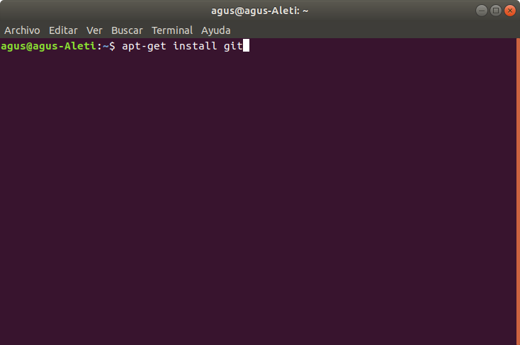
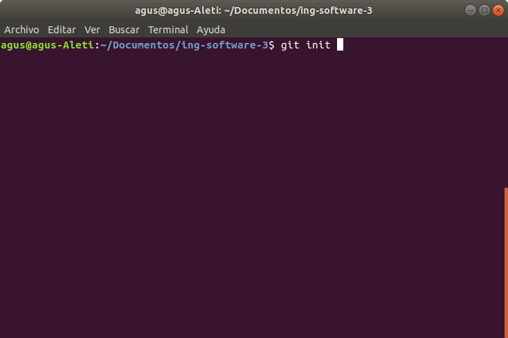
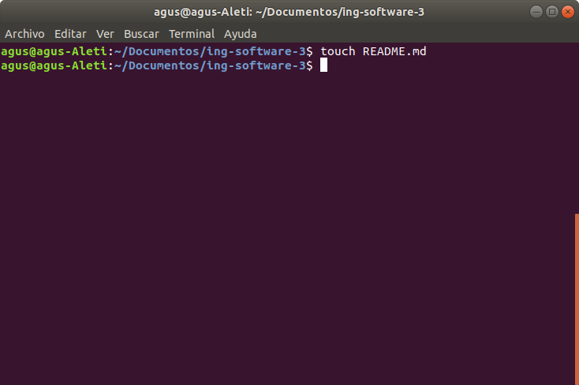
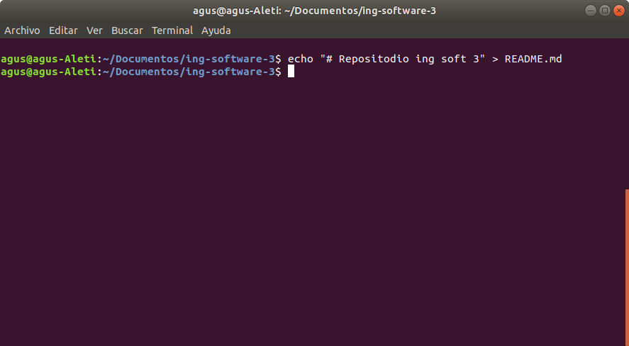
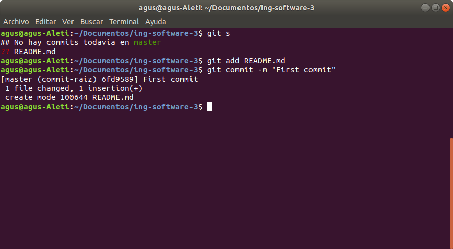
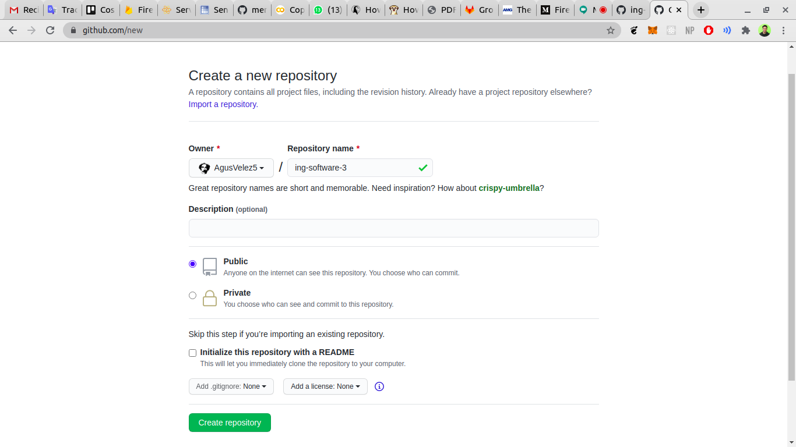
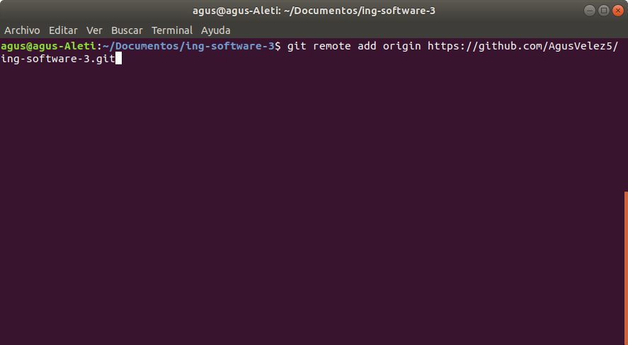
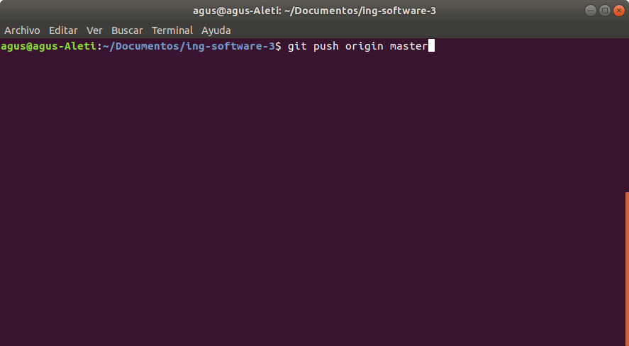
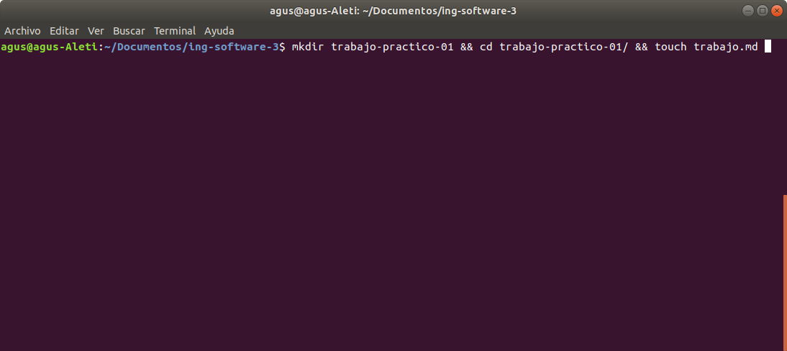

# Trabajo numero 1
## Git

#### Install git

#### Init git 

#### Create readme

#### Initial commit

#### Create repo

#### Link repo

#### Push initial commit

#### Create this file

## Pull request

Un pull request es una petición que el propietario de un fork de un repositorio hace al propietario del repositorio original para que este último incorpore los commits que están en el fork. 