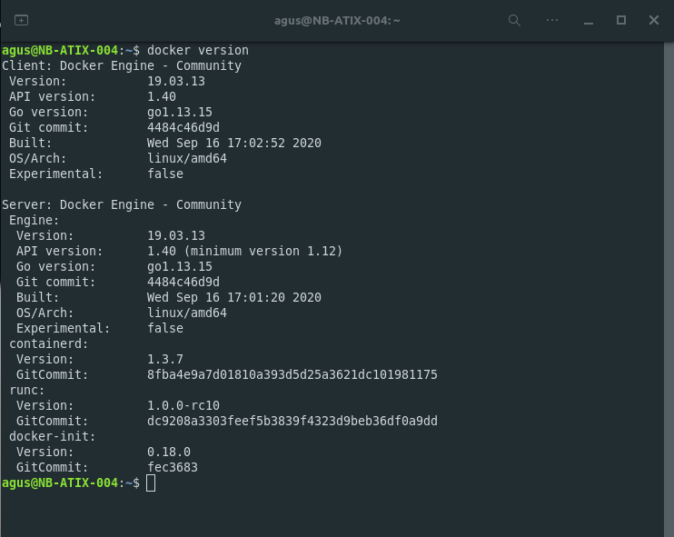
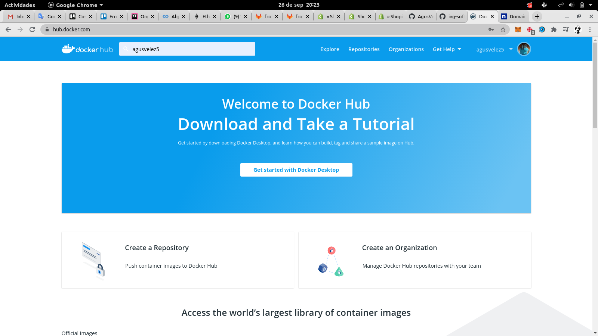
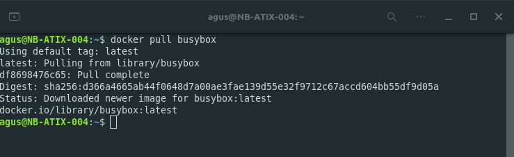
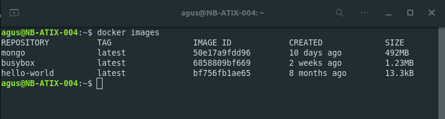
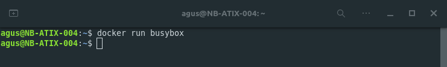
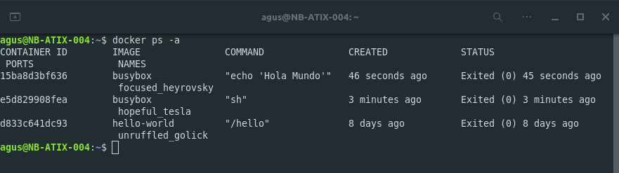
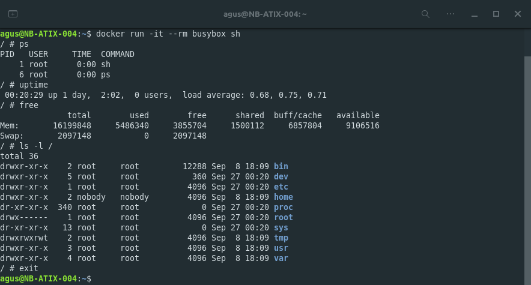
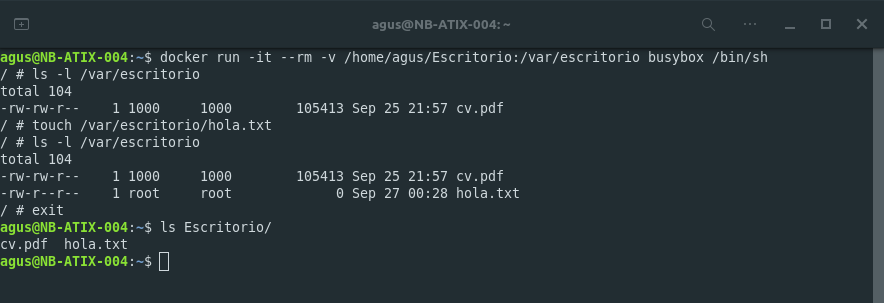
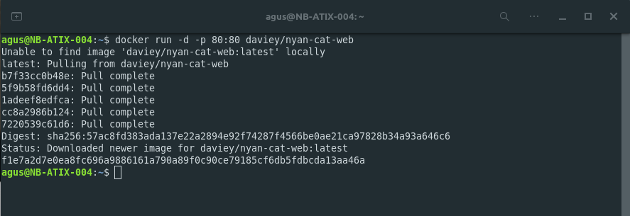
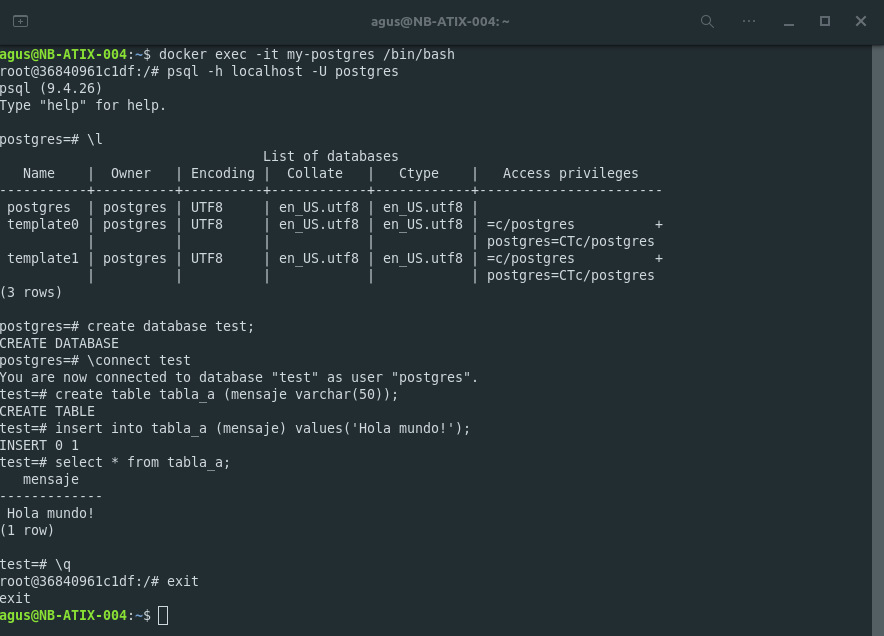

# Trabajo numero 2
## Introducción Docker

### Install docker

### Docker hub

### Busybox

### Docker images

Al ejecutar el comando anterior no se obtiene ningun resultado por que no le estamos pasando ningun argumento al entrypoint.

### Remove exited containers

### Volumes

### Expose ports

Exponemos el puerto 80 del contenedor en el puerto 80 del host lo cual nos permite interactuar con la aplicación.

### Database

Con el comando docker run creamos el contenedor y con el comando docker exec ejecutamos un comando dentro del contenedor, en este caso, el bash.