# Trabajo numero 3
## Arquitectura sistemas distruibuidos

### Create network
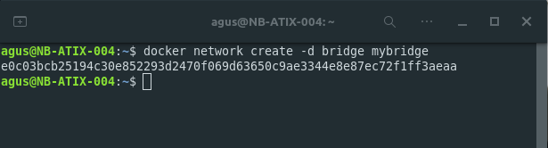

### Redis
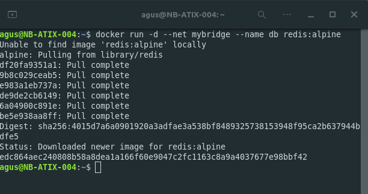

### Web app
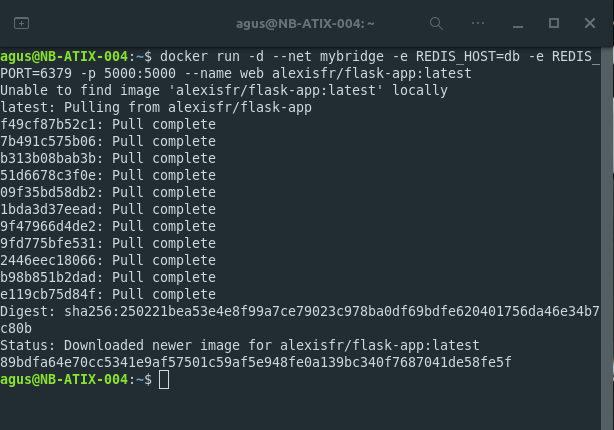

### Information

~~~
docker network inspect mybridge 
~~~

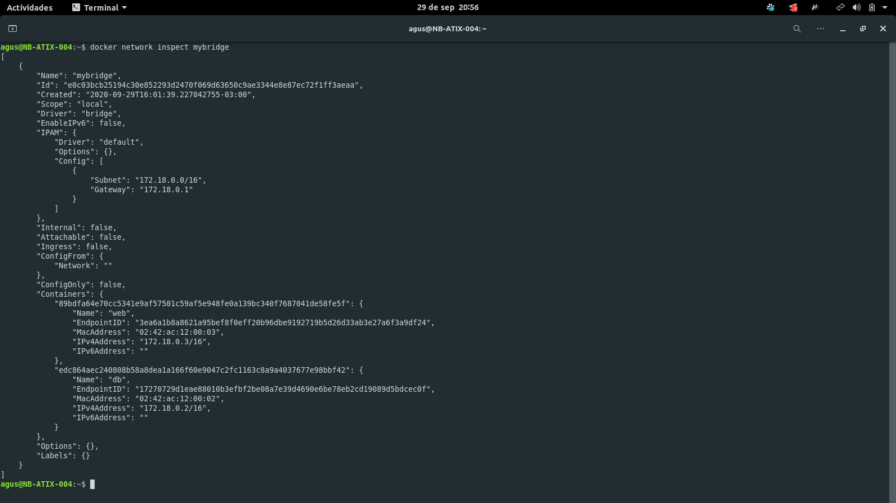

~~~
docker container inspect web
~~~

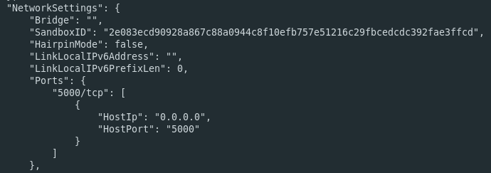

~~~
docker container inspect db
~~~

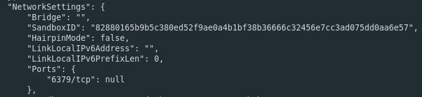

### Web app code
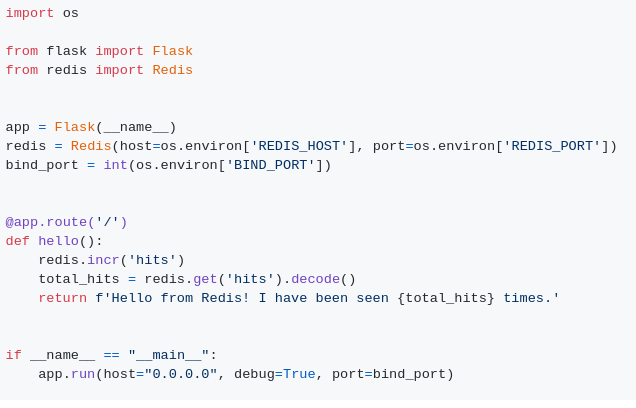

La aplicación esta conformada por dos componentes, una simple api y una base de datos redis. La db esta persistiendo un contador con la cantidad de visitas al sitio, el cual luego es mostrado por la api. Para lograr esto, ambos componentes estan dentro de containers, los cuales se comunican por la network de docker "mybridge"; a su vez el container web esta exponiendo el puerto 5000 en el puerto 5000 del host.

- - - 

Los parametros -e en el segundo comando estan para establecer variables de entorno en el contenedor creado. Estas variables luego son utilizadas por la aplicación:

~~~
redis = Redis(host=os.environ['REDIS_HOST'], port=os.environ['REDIS_PORT'])
~~~

- - -

Borramos el contenedor web

~~~
docker rm -f web
~~~

Volvemos a levantas el contenedor web

~~~
docker run -d --net mybridge -e REDIS_HOST=db -e REDIS_PORT=6379 -p 5000:5000 --name web alexisfr/flask-app:latest
~~~

La aplicación continua funcionando perfectamente ya que es stateless y los datos los persiste redis.

- - - 

Borramos el contenedor db

~~~
docker rm -f db
~~~

Al acceder a localhost:5000 obtenemos un error de conexion a redis.

Levantamos nuevamente la db.

~~~
docker run -d --net mybridge --name db redis:alpine
~~~

La aplicación vuelve a funcionar pero se perdio la cuenta de las vistas, para evitar esto podriamos utilizar volumenes para persistir los datos mas alla de las instancias levantadas.

### Docker compose

Ejecutamos: 

~~~
docker-compose up -d
~~~

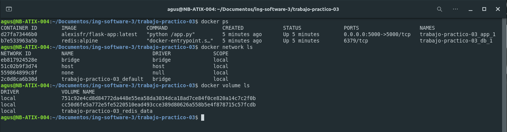

Docker compose levanto dos contenedores por nosotros. Llamados {nombre_directorio}_app_1 y {nombre_directorio}_db_1. 

El contenedor 'app' tiene estas caracteristicas:

* Creado a  partir de la imagen 'alexisfr/flask-app:latest'.
* Tiene una dependencia con el contenedor 'db', por ende app sera creado luego de db.
* Le pasamos dos variables de entorno.
* Exponemos el puerto 5000 del contenedor en el puerto 5000 del host.

El contenedor 'db' tiene estas caracteristicas:

* Creado a  partir de la imagen 'redis:alpine'.
* Tiene un volumen asociado.

### Voting app
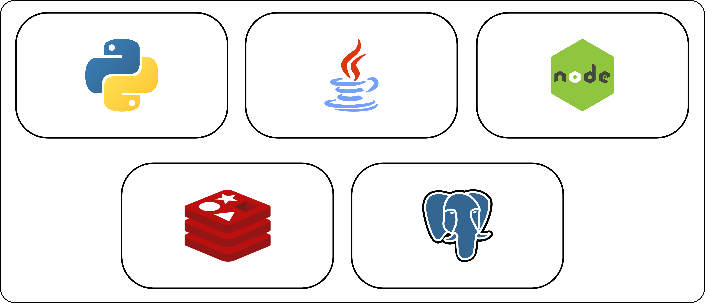

El contenedor 'vote' tiene estas caracteristicas:

* Contiene una aplicación python.
* Se construye a partir del dockerfile ubicado en './vote'.
* Se expone el puerto 80 del contenedor en el puerto 5000 del host.
* Pertenece a dos networks internas de docker, 'front-tier' y 'back-tier'.
* Posee un volumen.

El contenedor 'worker' tiene estas caracteristicas:

* Contiene una aplicación java.
* Se construye a partir del dockerfile ubicado en './worker'.
* Depende de otros dos componentes, 'redis' y 'db'.
* Pertenece a la network interna de docker, 'back-tier'.

El contenedor 'result' tiene estas caracteristicas:

* Contiene una aplicación node js.
* Se construye a partir del dockerfile ubicado en './result'.
* Se expone el puerto 5858 del contenedor en el puerto 5858 del host.
* Se expone el puerto 80 del contenedor en el puerto 5001 del host.
* Pertenece a dos networks internas de docker, 'front-tier' y 'back-tier'.
* Posee un volumen.

El contenedor 'redis' tiene estas caracteristicas:

* Contiene una base de datos redis.
* Se construye a partir de la imagen 'redis:alpine'.
* Pertenece a una network interna de docker, 'back-tier'.

El contenedor 'db' tiene estas caracteristicas:

* Contiene una base de datos postgres.
* Se construye a partir de la imagen 'postgres:9.4'.
* Se le pasan dos variables de entorno.
* Pertenece a una network interna de docker, 'back-tier'.
* Posee un volumen.

Flujo entre aplicaciones:
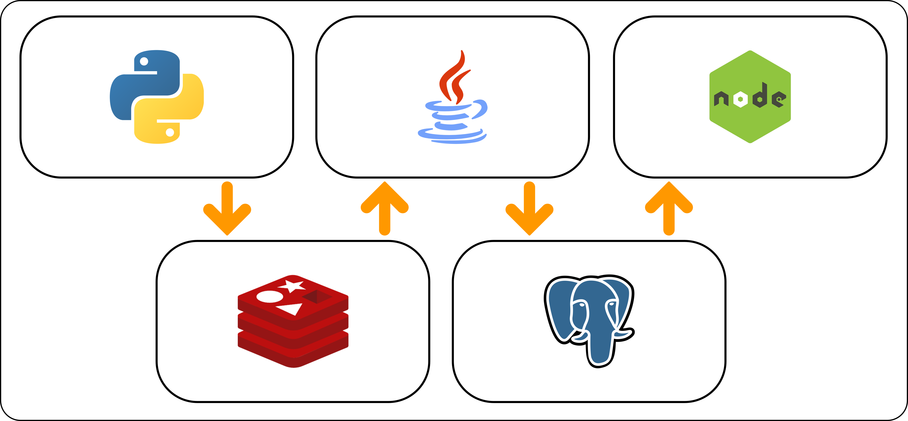

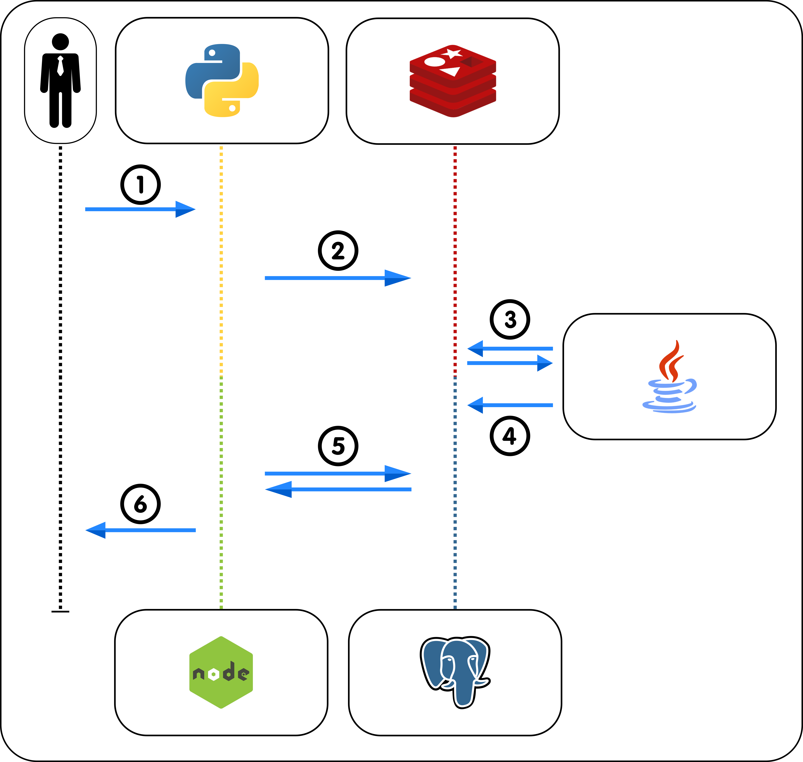

1. Ingreso del voto de un usuario por 'localhost:5000' a la aplicación python.
2. Ingreso de la información del voto desde la app de python a redis.
3. El worker de java esta observando la cola en redis, al momento en que ingresan votos los toma.
4. El worker ingresa a la db el voto tomado desde la cola.
5. La app node esta constantemente pidiendo los nuevos votos desde la db.
6. La app node visualiza la cuenta de votos en 'localhost:5001'.