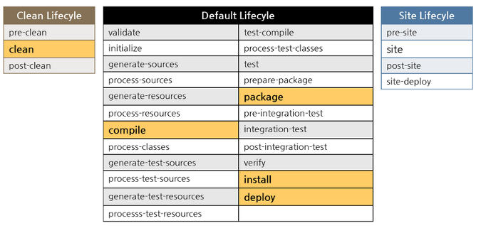
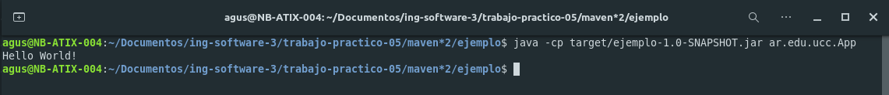
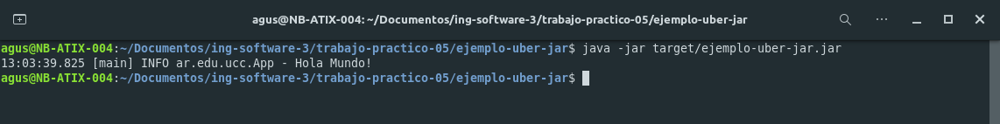

# Trabajo numero 5
## Herramientas de construcción de software

### Maven

Maven es una herramienta de software para la gestión y construcción de proyectos Java.

Maven utiliza un Project Object Model (POM) para describir el proyecto de software a construir, sus dependencias de otros módulos y componentes externos, y el orden de construcción de los elementos. Viene con objetivos predefinidos para realizar ciertas tareas claramente definidas, como la compilación del código y su empaquetado.

El archivo POM esta escrito en XML, algunas de sus etiquetas son:

* modelVersion: es la version del modelo de POM.
* groupId: el id del grupo del proyecto.
* artifactId: el id del proyecto.
* versionId: la version del proyecto.

Maven tiene tres maneras de buscar las dependencias que necesita tu proyecto: local, remote y central.

* Local: se encuentra en el host donde corre maven.
* Central: si no se encuentra las dependencias necesarias en el repositorio local, estas se buscan en el repositorio central el cual es mantenido por la comunidad.
* Remote: son repositorios de terceros.

Al construir una aplicación hay diferentes ciclos de vida:

* default: gestiona la implementación del proyecto.
  * Muchos pasos.
* clean: elimina los archivos generados (.jar .war).
  * pre-clean
  * clean
  * post-clean
* site: Genera un sitio web con la información de nuestro proyecto. Dicha información debe escribirse en el fichero pom.xml y ficheros .apt separados.
  * pre-site
  * site
  * post-site
  * site-deploy



- - -

Si ejecutamos el comando: 

~~~
mvn clean install
~~~

En el [directorio](./maven/vacio/) nos generara el archivo .jar a partir del pom.xml

- - -

Generamos un nuevo proyecto en el [directorio](./maven*2/):

~~~
mvn archetype:generate -DgroupId=ar.edu.ucc -DartifactId=ejemplo -DarchetypeArtifactId=maven-archetype-quickstart -DinteractiveMode=false
~~~

Obtenemos esta estructura:

~~~
.
└── ejemplo
    ├── pom.xml
    └── src
        ├── main
        │   └── java
        │       └── ar
        │           └── edu
        │               └── ucc
        │                   └── App.java
        └── test
            └── java
                └── ar
                    └── edu
                        └── ucc
                            └── AppTest.java

12 directories, 3 files
~~~

Compilamos con ```mvn clean package```.

Ejecutamos con ```java -cp target/ejemplo-1.0-SNAPSHOT.jar ar.edu.ucc.App```.



- - -

[ejemplo-uber-jar](./ejemplo-uber-jar/):



- - -

### NodeJS

El Node Package Manager (NPM) almacena las dependencias de nuestro proyecto (entre otras configuraciones) en el archivo ```package.json```.

Mientras que el ```package.json``` permite configurar las dependencias para un rango de versiones posibles, el ```package-lock.json``` es la foto de las dependencias exactas que se descargaron en tu máquina, incluyendo las dependencias indirectas.

Esto permite que todos los desarrolladores (y especialmente el CI) puedan replicar el mismo entorno y que las versiones que instalamos no dependa del momento en el que hacemos ```npm install```.

Todo el codigo de nuestras dependencias se encuentra en la carpeta ```node_modules```. Por lo cual este directorio suele ser muy pesado.


- - -

### Python

El comando ```pip``` es el administrador de paquetes estándar para Python. Le permite instalar y administrar paquetes adicionales que no forman parte de la biblioteca estándar de Python.

El comando ```cookiecutter``` es una herramienta que se utiliza para generar templates de proyectos y luego generando proyectos a partir de ellos.

El comando ```make``` es una herramienta de gestión de dependencias usada en entornos UNIX. Cuando tu código se compone de varios ficheros de código fuente, es una utilidad muy práctica para compilar de una forma automatizada. Pero se necesita crear un archivo makefile desde donde obtenga todo lo que necesita para el proceso. 

- - - 

### Herramientas de construcción

* C/C++: Conan
* Python: Poetry
* JavaScript: Yarn
* PHP: Composer
* Go: dep
* Perl: ppm
* Ruby: Gems
* Dart: Dart Packages
* Swift: Package Manager
* C#: Nuget