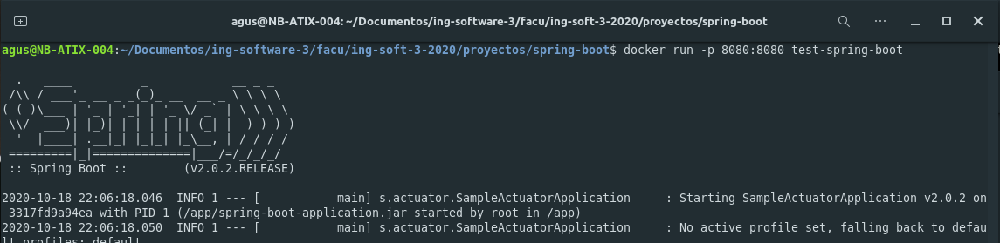

# Trabajo numero 6
## Construcción de Imágenes de Docker

### Dockerfile

Comandos:

* FROM: inicializa una nueva etapa de construcción y establece la imagen base para instrucciones posteriores. Un Dockerfile válido debe comenzar con una instrucción ```FROM```. 
* RUN: ejecuta cualquier comando en una nueva capa sobre la imagen actual. La imagen resultante se utilizará para el siguiente paso en el Dockerfile.
* ADD: copia archivos, directorios o archivos remotos dentro del sistema de archivos del contenedor.
* COPY: copia archivos o directorios dentro del sistema de archivos del contenedor.
* EXPOSE: informa a Docker que el contenedor escucha en los puertos de red especificados en tiempo de ejecución. Pero realmente no publica el puerto, se utiliza como una documentación entre el creador de la imagen y la persona que corre el contenerdor.
* CMD: proporsiona valores por defecto para un contenedor corriendo. Puede haber un único comando ```CMD```, en el que caso que halla mas de uno se utilizara el último declarado.
* ENTRYPOINT: permite configurar un contenedor que se ejecutará como ejecutable.

- - -

### Generando imagen de docker



- - -

### Interpretando Dockerfile multi-stage

~~~ Dockerfile
FROM maven:3.5.2-jdk-8-alpine AS MAVEN_TOOL_CHAIN
COPY pom.xml /tmp/
RUN mvn -B dependency:go-offline -f /tmp/pom.xml -s /usr/share/maven/ref/settings-docker.xml
COPY src /tmp/src/
WORKDIR /tmp/
RUN mvn -B -s /usr/share/maven/ref/settings-docker.xml package

FROM java:8-jre-alpine

EXPOSE 8080

RUN mkdir /app
COPY --from=MAVEN_TOOL_CHAIN /tmp/target/*.jar /app/spring-boot-application.jar

ENV JAVA_OPTS="-Xms32m -Xmx128m"

ENTRYPOINT exec java $JAVA_OPTS -Djava.security.egd=file:/dev/./urandom -jar /app/spring-boot-application.jar

HEALTHCHECK --interval=1m --timeout=3s CMD wget -q -T 3 -s http://localhost:8080/actuator/health/ || exit 1
~~~

En la primera etapa de nuestro Dockerfile:

~~~ Dockerfile
FROM maven:3.5.2-jdk-8-alpine AS MAVEN_TOOL_CHAIN
COPY pom.xml /tmp/
RUN mvn -B dependency:go-offline -f /tmp/pom.xml -s /usr/share/maven/ref/settings-docker.xml
COPY src /tmp/src/
WORKDIR /tmp/
RUN mvn -B -s /usr/share/maven/ref/settings-docker.xml package
~~~

Generamos una imagen temporal donde descargamos todas las dependencias necesarias, agregamos nuestro codigo local y finalmente construimos la aplicación.

En la segunda etapa de nuestro Dockerfile:

~~~ Dockerfile
FROM java:8-jre-alpine

EXPOSE 8080

RUN mkdir /app
COPY --from=MAVEN_TOOL_CHAIN /tmp/target/*.jar /app/spring-boot-application.jar

ENV JAVA_OPTS="-Xms32m -Xmx128m"

ENTRYPOINT exec java $JAVA_OPTS -Djava.security.egd=file:/dev/./urandom -jar /app/spring-boot-application.jar

HEALTHCHECK --interval=1m --timeout=3s CMD wget -q -T 3 -s http://localhost:8080/actuator/health/ || exit 1
~~~

Corremos nuestra aplicación, la cual obtenemos a partir de la imagen anterior ```--from=MAVEN_TOOL_CHAIN```.

- - -

### Python-flask

Ejecutamos un ```docker-compose up -d``` en el [directorio](./python-flask/) de la aplicación.
Esto nos levanta dos servicios, una aplicación python y una db redis.
Dentro del archivo docker-compose.yml vemos:

~~~
app:
    build:
      context: ./
~~~

Lo cual se utiliza para definirle al servicio app donde debe buscar el dockerfile a utilizar.

- - -

### Construyendo Dockerfile multi-stage

Cree dos dockerfiles para la aplicación [hola-mundo](./hola-mundo/):

* Dockerfile.debug: Orientado para debuggear donde la aplicación corre sobre un linux.
* Dockerfile.prod: Orientado para producción donde la aplicación corre sobre una ["Distroless" image](https://github.com/GoogleContainerTools/distroless).

From github:
~~~
"Distroless" images contain only your application and its runtime dependencies. They do not contain package managers, shells or any other programs you would expect to find in a standard Linux distribution.
~~~

- - -

### Dockerhub

