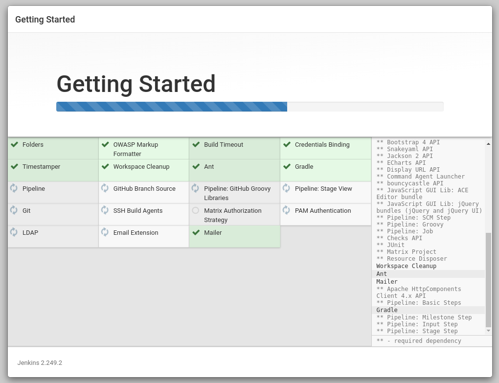
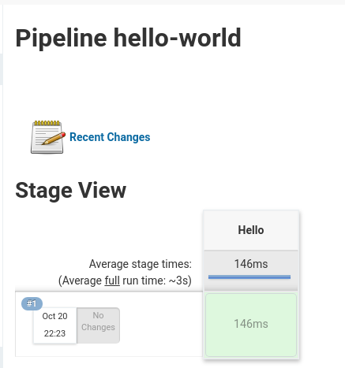
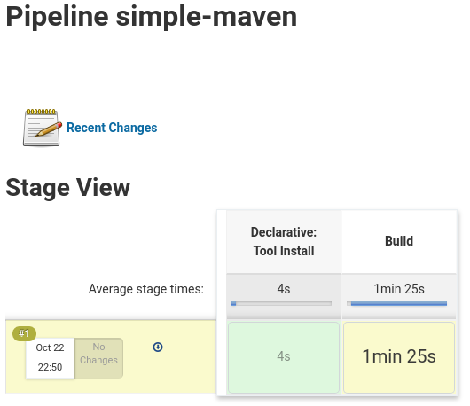
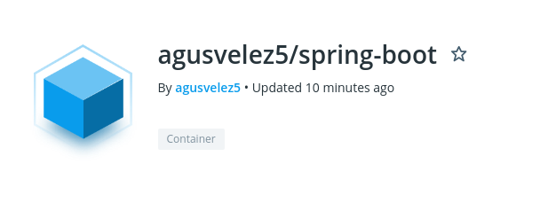

# Trabajo numero 7
## Servidor de Build

[__Repositorio Spring App__](https://github.com/AgusVelez5/spring-boot-app)

- - -

### Set up Jenkins

- - -

### Hello world pipeline

- - -

### Simple maven pipeline

~~~groovy
pipeline {
    agent any

    tools {
        maven "M3"
    }

    stages {
        stage('Build') {
            steps {
                git 'https://github.com/jglick/simple-maven-project-with-tests.git'

                sh "mvn -Dmaven.test.failure.ignore=true clean package"
            }

            post {
                success {
                    junit '**/target/surefire-reports/TEST-*.xml'
                    archiveArtifacts 'target/*.jar'
                }
            }
        }
    }
}
~~~

- - -

### Pipeline spring-boot

~~~groovy
pipeline {
    agent any

    tools {
        maven "M3"
    }

    stages {
        stage('Build') {
            steps {
                git(url: 'https://github.com/AgusVelez5/spring-boot-app.git', branch: 'master', poll: true)
                sh 'mvn -Dmaven.test.failure.ignore=true clean package'
            }

            post {
                success {
                    archiveArtifacts 'target/*.jar'
                }
            }
        }
    }
}
~~~

- - -

### Pipeline spring-boot docker

~~~groovy
pipeline {
    agent any

    environment { 
        registry = "agusvelez5/spring-boot" 
        registryCredential = 'docker-hub-credentials' 
    }
    
    
    stages {
        stage('Build') {
            steps {
                git(url: 'https://github.com/AgusVelez5/spring-boot-app.git', branch: 'master', poll: true)
                sh 'docker build -t $registry:$BUILD_ID .'
            }
        }
        
        stage('Push image') {
            steps {
                withCredentials([usernamePassword( credentialsId: 'docker-hub-credentials', usernameVariable: 'USERNAME', passwordVariable: 'PASSWORD')]) {
                    script {
                        docker.withRegistry('', 'docker-hub-credentials') {
                            sh "docker login -u ${USERNAME} -p ${PASSWORD}"
                            sh "docker push $registry:$BUILD_ID"
                        }   
                    }
                }   
            }
        }
    }
}
~~~

