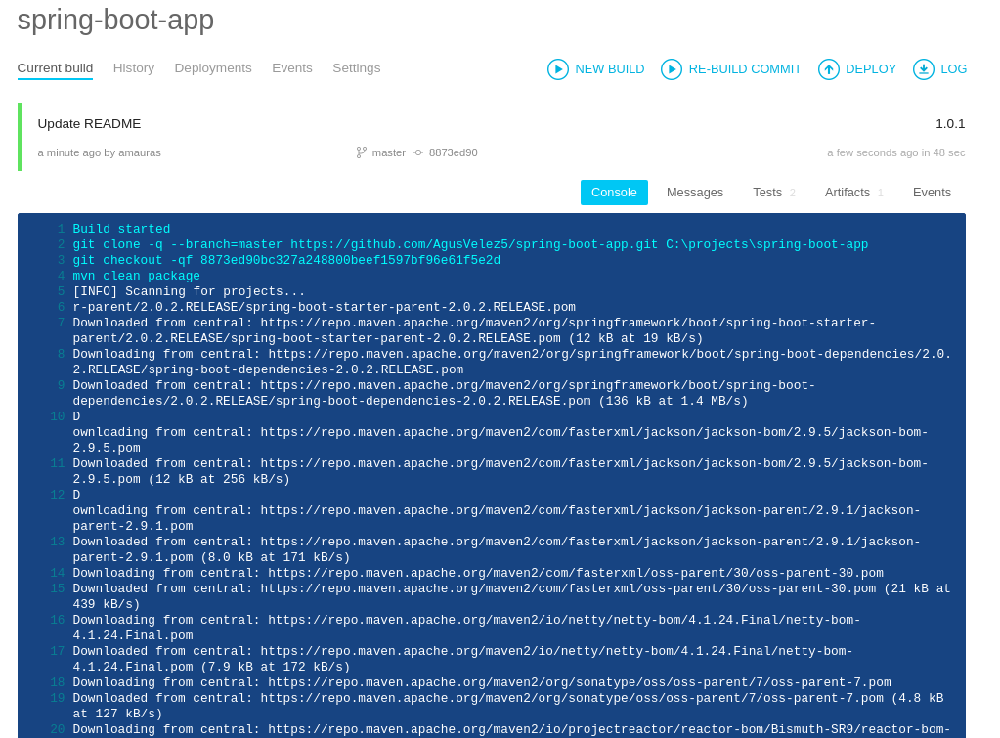
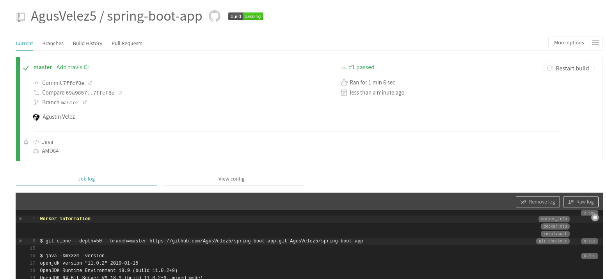
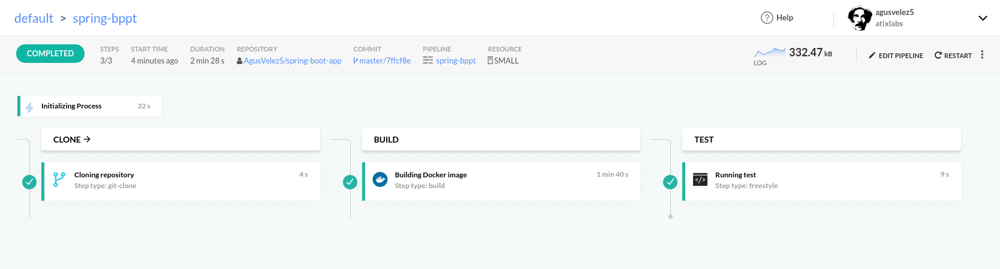
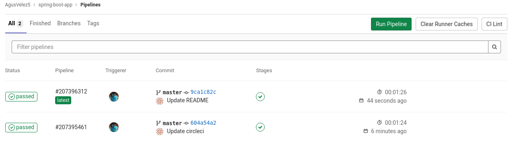
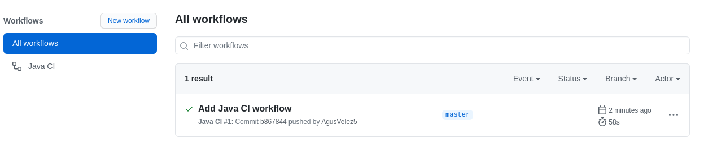
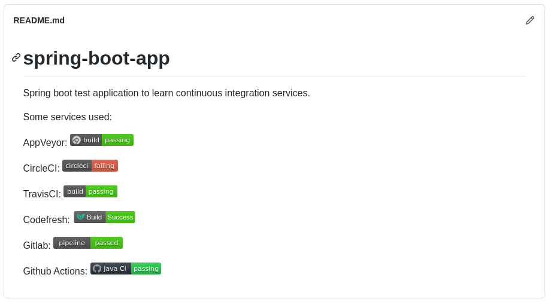

# Trabajo numero 8
## Herramientas de construcción de software en la nube

[__Repositorio de Pruebas__](https://github.com/AgusVelez5/spring-boot-app)

__Beneficios__:

* Permiten construccion de aplicaciones de forma automatizada y con poca configuración.
* Algunas herramientas proveen analitics.
* Escalabilidad a demanda.

__Contras__:

* En ciertas ocasiones hay que "casarse" con una tecnología o metodología.
* Por mas que sean herramientas de total confianza, uno esta atado a su disponibilidad.

- - -

###  AppVeyor

### Travis CI

### CodeFresh

### Gitlab

### Github Actions

- - -

__Conclusion__:

A pesar que construi pipelines extremadamente sencillos pude entender el formato y como funcionan. Travis, Codefresh y Gitlab me resulto muy sencillo tanto la aplicación como la sintaxis utilizada. CircleCI no lo pude hacer andar de manera rapida asi que esto refleja un contraste con las otras tecnologías. Finalmente probe github actions y me resulto muy intuitivo y bastante bien documentado.

