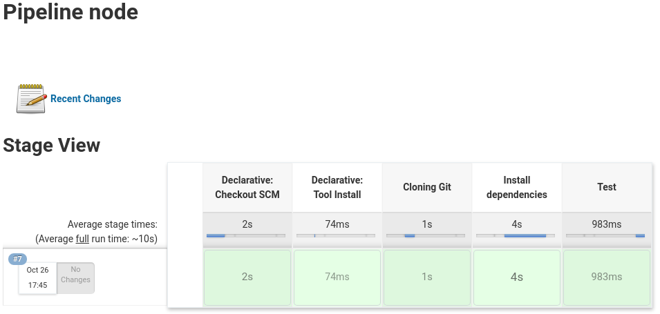
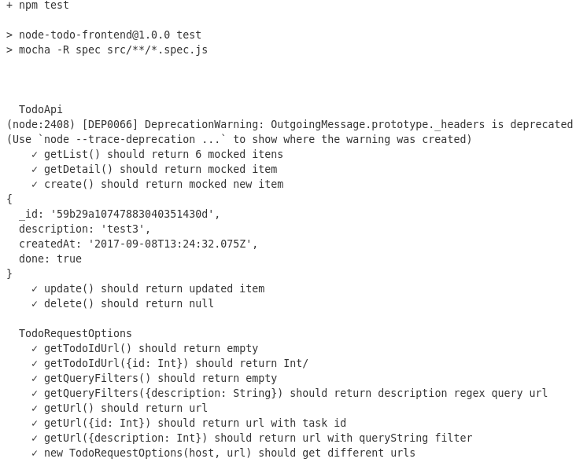
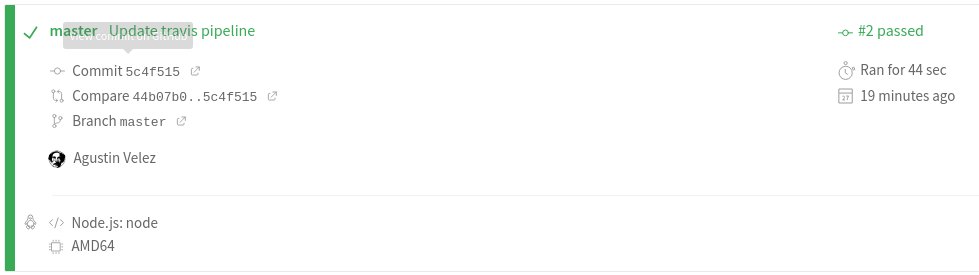
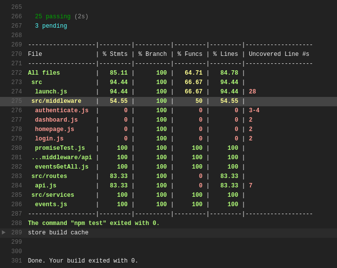

# Trabajo numero 9
## Pruebas de unidad

Para este trabajo utilice un [fork](https://github.com/AgusVelez5/js-unit-testing-examples) de este [repositorio](https://github.com/MarcL/js-unit-testing-examples).

- - -

## Mocking Libraries

### Sinon 

En esta aplicación se utiliza [Sinon JS](https://sinonjs.org/) la cual es una biblioteca de JavaScript popular que permite reemplazar partes complicadas de su código. Nos permite crear mocks de objetos para pruebas unitarias.

### node-mocks-http

Tambien utilizamos la libreria [node-mocks-http](https://www.npmjs.com/package/node-mocks-http) que nos permite crear mocks de request http o responses. Por ejemplo para probar diferentes rutas de [express](https://expressjs.com/)

- - -

### Jenkins

~~~groovy
pipeline {
    agent any

    tools {nodejs "node"}

    stages {

        stage('Cloning Git') {
            steps {
                git 'https://github.com/gustavoapolinario/node-todo-frontend'
            }
        }

        stage('Install dependencies') {
            steps {
                sh 'npm install'
            }
        }

        stage('Test') {
            steps {
                sh 'npm test'
            }
        }
  }
}
~~~

- - -

### Travis

~~~yaml
language: node_js
node_js:
  - "node"
install:
  - "npm install"
script: npm test
~~~

