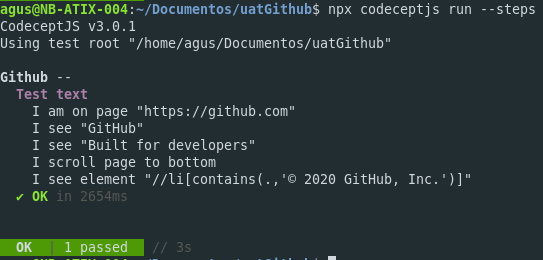
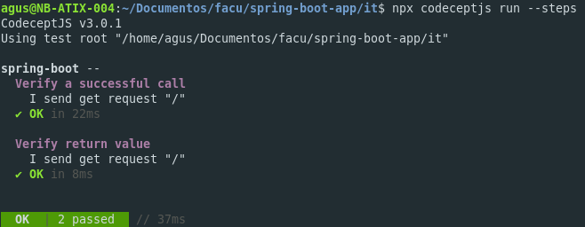
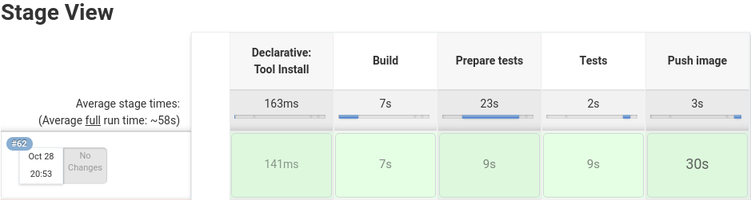
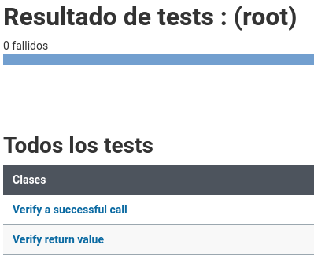

# Trabajo numero 10
## Pruebas de Integración

### Testing Github

~~~javascript
Feature('Github');

Scenario('Test text', ({ I }) => {
    I.amOnPage('https://github.com');
    I.see('GitHub');
    I.see('Built for developers');
    I.scrollPageToBottom();
    I.seeElement("//li[contains(.,'© 2020 GitHub, Inc.')]");
});
~~~

### Testing spring-boot-app

[__Tests__]()

~~~javascript
Feature('spring-boot');

const expect = require('chai').expect;
const {I} = inject();

Scenario('Verify a successful call', async () => {
	const res = await I.sendGetRequest('/');
	expect(res.status).to.eql(200);
});

Scenario('Verify return value', async () => {
	const res = await I.sendGetRequest('/');
	//console.log(res);
	expect(res.data.message).to.eql('Spring boot says hello from a Docker container');
~~~

- - - 

### New Jenkinsfile

~~~groovy
pipeline {
    agent any

    tools {
        nodejs "node"
        maven "M3"
    }

    environment { 
        registry = "agusvelez5/spring-boot" 
        registryCredential = 'docker-hub-credentials' 
    }
    
    stages {
        stage('Build') {
            steps {
                git(url: 'https://github.com/AgusVelez5/spring-boot-app.git', branch: 'master', poll: true)
                sh 'docker build -t $registry:$BUILD_ID .'
            }
        }
        
        stage('Prepare tests') {
            steps{
                sh script:'''
                  #!/bin/bash
                  mvn -Dmaven.test.failure.ignore=true clean package
                  cd ./it
                  npm install
                '''
            }
        }
        
        stage('Tests') {
            steps {
                sh script:'''
                  #!/bin/bash
                  java -jar target/spring-boot-sample-actuator-2.0.2.jar &
                  sleep 7
                  cd ./it
                  npx codeceptjs run --steps --reporter mocha-multi
                '''
            }
            
            post {
                success {
                    junit '**/output/*.xml'
                }
            }
        }
        
        stage('Push image') {
            steps {
                withCredentials([usernamePassword( credentialsId: 'docker-hub-credentials', usernameVariable: 'USERNAME', passwordVariable: 'PASSWORD')]) {
                    script {
                        docker.withRegistry('', 'docker-hub-credentials') {
                            sh "docker login -u ${USERNAME} -p ${PASSWORD}"
                            sh "docker push $registry:$BUILD_ID"
                        }   
                    }
                }   
            }
        }
    }
}
~~~

