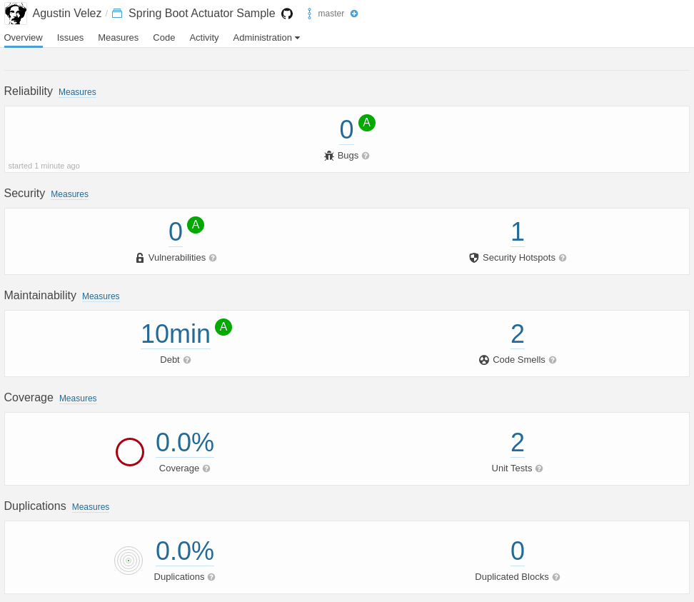
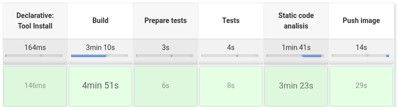

# Trabajo numero 11
## Métricas de código

### FileIO Bugs

Before:

~~~java
try {
    String text = this.textField.getText();
    byte b[] = text.getBytes();
    String outputFileName = System.getProperty("user.home", File.separatorChar + "home" + File.separatorChar + "zelda") + File.separatorChar
            + "text.txt";
    FileOutputStream out = new FileOutputStream(outputFileName);
    out.write(b);
    out.close();
} catch (java.io.IOException e) {
    logger.info("Cannot write to text.txt");
}
~~~

After:

~~~java
try {
    String text = this.textField.getText();
    byte b[] = text.getBytes();
    String outputFileName = System.getProperty("user.home", File.separatorChar + "home" + File.separatorChar + "zelda") + File.separatorChar
            + "text.txt";
    FileOutputStream out = new FileOutputStream(outputFileName);
    out.write(b);
} catch (java.io.IOException e) {
    logger.info("Cannot write to text.txt");
} finally {
    out.close();
}
~~~

Before:

~~~java
try {
    String inputFileName = System.getProperty("user.home", File.separatorChar + "home" + File.separatorChar + "zelda") + File.separatorChar
            + "text.txt";
    File inputFile = new File(inputFileName);
    FileInputStream in = new FileInputStream(inputFile);
    byte bt[] = new byte[(int) inputFile.length()];
    in.read(bt);
    s = new String(bt);
    in.close();
} catch (java.io.IOException e) {
    logger.info("Cannot read from text.txt");
}
~~~

After:

~~~java
try {
    String inputFileName = System.getProperty("user.home", File.separatorChar + "home" + File.separatorChar + "zelda") + File.separatorChar
            + "text.txt";
    File inputFile = new File(inputFileName);
    FileInputStream in = new FileInputStream(inputFile);
    byte bt[] = new byte[(int) inputFile.length()];
    int count = 0;
    while (count = in.read(bt) > 0) {
        s = new String(bt);
    }
} catch (java.io.IOException e) {
    logger.info("Cannot read from text.txt");
} finally {
    in.close();
}
~~~

- - -

### MySQLAccess security vulnerabilities

Before:

~~~java
try {
    String userName = "root";
    String password = "root";
    String url = "jdbc:mysql://localhost/table";
    try {
        // The newInstance() call is a work around for some
        // broken Java implementations
        // This will load the MySQL driver, each DB has its own driver
        Class.forName("org.gjt.mm.mysql.Driver").newInstance();
        logger.info("MySQL driver loaded");
    } catch (Exception E) {
        System.err.println("Unable to load driver.");
        E.printStackTrace();
    }
    // Setup the connection with the DB
    this.connect = DriverManager.getConnection(url, userName, password);
    if (!this.connect.isClosed()) {
        logger.info("Successfully connected to " + "MySQL server using TCP/IP...");
    }
    logger.info("Database connection established");
} catch (Exception e) {
    System.err.println("Cannot connect to database server");
    e.printStackTrace();
}
~~~

After:

~~~java
try {
    String userName = "root";
    String password = System.getenv("MYSLQ_PASS");
    String url = "jdbc:mysql://localhost/table";
    try {
        // The newInstance() call is a work around for some
        // broken Java implementations
        // This will load the MySQL driver, each DB has its own driver
        Class.forName("org.gjt.mm.mysql.Driver").newInstance();
        logger.info("MySQL driver loaded");
    } catch (Exception E) {
        System.err.println("Unable to load driver.");
    }
    // Setup the connection with the DB
    this.connect = DriverManager.getConnection(url, userName, password);
    if (!this.connect.isClosed()) {
        logger.info("Successfully connected to " + "MySQL server using TCP/IP...");
    }
    logger.info("Database connection established");
} catch (Exception e) {
    System.err.println("Cannot connect to database server");
}
~~~

- - -

### Calculator code smells

* Repetición de constantes
* Bloques de codigos innecesarios
* No sigue CamelCase

Segun [sonarcloud](https://sonarcloud.io/) es necesario 1 d y 4h de esfuerzo para eliminar estos code smells.

- - -

### EvalXML cyclomatic complexity

La __complejidad ciclomatica__ es una métrica la cual mide el número de flujos distintos de ejecución que puede contener nuestro código.

La __complejidad cognitiva__ es una medida que refleja cómo es de difícil entender intuitivamente un bloque de código.

Al momento de buscar la funcion con mayor complejidad ciclomatica estoy entre dos, __toElementNodeList__ y __factor__.

La clase EvalXML tiene una complejidad ciclomatica de __54__.
La clase EvalXML tiene una complejidad cognitiva de __83__.

- - -

### TaskScheduler code duplications

- - -

### Spring Boot on Sonarcloud

Jenkins:

[__Jenkinsfile__](https://github.com/AgusVelez5/spring-boot-app/blob/master/Jenkinsfile.docker)

